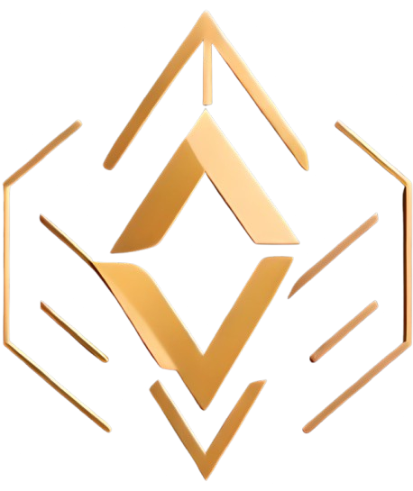

> [!WARNING]  
> This is a proof of concept for the traditional snowball product (read more [here](https://www.allianzgi.com/en/insights/the-china-briefing/snowballs-and-structured-products)) in DeFi, developed for the [Ethena Hackathon](https://www.encode.club/ethena-hackathon) and deployed on the [Ethena Testnet](https://network.ethena.fi/developers). Please note that there are many assumptions, and the contracts have not been audited. Do not use this in production.

<p align = "center"> 
  
  <h2 align="center">Delta Vault</h2>
</p align = "center">
<p align="center">Unlocking High-Yield Opportunities, One Snowball at a Time!</p>
  <p align="center">
    <a href="https://youtu.be/OonCafY-Ung">Video Demo</a>
  </p>

<!-- 
MockWBTC deployed to: 0x5cd0a85594669741E908d094ad1f13943D37c514 /
DeltaVaultProduct deployed to: 0xE56Cbd1ad4979bc51344aBAaD2eBd3eEda02e084 /
PriceObserver deployed to: 0x09D32a699CfA758C04683E7AbF16D7644fe14644 /
HedgeExecutor deployed to: 0x885348221D80F376276D390D2BeB4B516918c632 /
DeltaVaultFactory deployed to: 0xA45BaFe594b05Cd51d1B95175e88F6e22C6E2c74 / 
-->


## About The Project

✨ Delta Vault is a project designed to bring the traditional financial product known as "Snowball" into the decentralized finance (DeFi) ecosystem. It provides DeFi users with a more lucrative opportunity to earn high yields in the derivatives market, incorporating unique features and strategies of snowball structured products inspired by traditional finance.

✨ A Snowball product is a structured hybrid derivative that pays a bond-like coupon and includes additional options on fundamental financial assets. These underlying assets can be stocks, stock indexes, or similar financial instruments.

✨ In Delta Vault's system, users stake USDe if they are bullish on BTC (currently, BTC is the only supported asset) or WBTC if they are bearish on BTC. The payout scenarios vary based on the structure of the Snowball product, which is explained in the [Snowball flow](#snowball-flow) diagram.

✨ The hedging strategy employed by Delta Vault is outlined in the [Strategy Overview](strategy-overview) section, providing insights into how risks are managed and returns are optimized.

***To know more about Snowball in crypto market, watch the video from OKX [here](https://static.okx.com/cdn/help/okex/earn/Snowball_video_english.mp4)***


## Inspiration

Delta Vault is inspired by the success of snowball products in traditional finance, particularly in the Chinese derivatives market. These products grew from 2-3 billion yuan ($0.3-0.5 billion) in 2016-2017 to over 50 billion yuan ($7.6 billion) by 2020, with an estimated market size of $45 billion by early 2024. OKX, the world's third-largest centralized derivatives exchange, launched its snowball products for BTC and ETH in 2023, highlighting the demand for such offerings. However, centralized control in traditional systems motivated me to create a decentralized alternative. Delta Vault aims to bring the benefits of snowball products to DeFi, eliminating the need for a central authority.

I chose [USDe](https://ethena.fi/) and the **Ethena Network** as they are best suited for this type of product. USDe and Ethena offer a more decentralized and potentially higher-yield stablecoin solution compared to traditional stablecoins like USDC or USDT. Unlike centralized stablecoins, USDe is backed by a synthetic dollar protocol with on-chain collateralization, while Ethena generates yields through its delta-neutral staking strategy.

Additionally, I drew inspiration from the simplistic UX and one-click UI of Fluid. Which motivated me to design a user-friendly and intuitive interface for Delta Vault, specifically targeting DeFi users.

## Protocol Structure

### 1. Strategy Overview

This strategy implements a dynamic hedging approach that generates buy/sell signals based on absolute returns and manages position sizes accordingly.

#### Core Components

1. **Signal Generation**
```python
Signal = {
    'Buy'  : if AbsReturn >= threshold and AbsReturn < 0
    'Sell' : if AbsReturn >= threshold and AbsReturn > 0
}
```

2. **Position Sizing**
```python
BuySellQuantity = {
    if Signal == 'Buy':
        min(available_cash, initial_position_value - current_position_value) / current_price
        
    if Signal == 'Sell':
        max(-current_position, (initial_position_value - current_position_value) / current_price)
}
```

3. **Portfolio Updates**
```python
# Position Update
new_position = current_position + buy_sell_quantity

# Cash Balance Update
new_cash = current_cash - (buy_sell_quantity * current_price)

# Price Tracking
last_price = current_price
```

### 2. Contracts Module ([`contracts`](./delta-vault-contracts))

- Contains the core contracts of Delta Vault.
- The contracts are deployedd on **Ethena Testnet**.
  - USDe OFT [`0x426E7d03f9803Dd11cb8616C65b99a3c0AfeA6dE`](https://explorer-ethena-testnet-0.t.conduit.xyz/token/0x426E7d03f9803Dd11cb8616C65b99a3c0AfeA6dE)
  - Delta Vault Factory [`0xA45BaFe594b05Cd51d1B95175e88F6e22C6E2c74`](https://explorer-ethena-testnet-0.t.conduit.xyz/address/0xA45BaFe594b05Cd51d1B95175e88F6e22C6E2c74)
  - Delta Vault Product [`0xE56Cbd1ad4979bc51344aBAaD2eBd3eEda02e084`](https://explorer-ethena-testnet-0.t.conduit.xyz/address/0xE56Cbd1ad4979bc51344aBAaD2eBd3eEda02e084)
  - Price Observer [`0x09D32a699CfA758C04683E7AbF16D7644fe14644`](https://explorer-ethena-testnet-0.t.conduit.xyz/address/0x09D32a699CfA758C04683E7AbF16D7644fe14644?tab=internal_txns)
  - Hedge Executor [`0x885348221D80F376276D390D2BeB4B516918c632`](https://explorer-ethena-testnet-0.t.conduit.xyz/address/0x885348221D80F376276D390D2BeB4B516918c632)
  - Mock WBTC [`0x5cd0a85594669741E908d094ad1f13943D37c514`](https://explorer-ethena-testnet-0.t.conduit.xyz/address/0x5cd0a85594669741E908d094ad1f13943D37c514?tab=internal_txns)

> [!NOTE]
> Currently, there is no DEX or dynamic method to swap tokens on the Ethena Network. However, the Etheral proposal has been passed ([proposal link](https://gov.ethenafoundation.com/t/introducing-ethereal-request-to-ethena-governance-on-integration/154/17)), paving the way for a new spot and perpetual futures DEX built on the Ethena Network using USDe.
> 
> To address the current limitations, keepers provide the necessary liquidity to facilitate token swaps during hedging operations.

### 3. Goldsky Subgraph ([`subgraph`](./delta-vault-goldsky-subgraph))

- Contains the Subgraphs for Delta Vault
- Mainly used to query the portfolio data.
- [Demo query link](https://api.goldsky.com/api/public/project_cm3z3gioefix501v6daxi2u5a/subgraphs/delta-vault/1.0.0/gn)

### 4. Keepers ([`keeper`](./keeper))

- Keepers function as backend oracle servers.
- Keep on checking snowball products (set intervals) for knock-ins, knock-outs, expiry, and asset price change events.
- Manage hedging of the product by applying the delta-neutral strategy.
- Ensure seamless operation and real-time updates for the delta vault.

<center>

## Architecture

### [Contract Flow](./resources/contract_flow.png)


<details>
<summary>

### [Snowball Flow](./resources/snowball-flow.png)

</summary>


</details>

</center>

<details>
<summary>

## Run Locally

</summary>

### Prerequisites

Before running the project locally, ensure you have the following installed:

- [Git](https://git-scm.com/downloads)
- [Node.js](https://nodejs.org/)
- [Docker](https://www.docker.com/get-started)

### Setting Up the Project

Follow these steps to set up and run the project locally:

1. **Clone the Repository**

   Open your terminal and run:

   ```bash
   git clone git@github.com:startup-dreamer/delta-vault.git
   ```

2. **Navigate to the Client Directory**

   ```bash
   cd delta-vault/delta-vault-client
   ```

3. **Install Dependencies**

   ```bash
   npm install
   ```

4. **Run the Interface Locally**

   ```bash
   npm run dev
   ```

   This command starts the development server, allowing you to access the interface at `http://localhost:3000`.

### Running the Keeper Service

The keeper service monitors snowball products and applies the delta-neutral strategy. To run it locally:

1. **Navigate to the Keeper Directory**

   ```bash
   cd delta-vault/keeper
   ```

2. **Set Up Environment Variables**

   Copy the example environment file:

   ```bash
   cp .env.example .env
   ```

   Edit the `.env` file to include your environment variables.

3. **Build and Start the Keeper Service**

   ```bash
   docker-compose up --build
   ```

   This command builds and starts the keeper service using Docker.

### Configuration Details

- **RPC_URL**: Set this to the URL where the contracts are deployed (e.g., Ethena Testnet).
- **Address**: Use the corresponding addresses of the deployed contracts on the same network.

Ensure these configurations are correctly set in your `.env` file to enable seamless operation.

</details>

## Future Work

### Future Work for Delta Vault

1. **Multi-Cryptocurrency Support**  
   Extend the vault to support a wide range of cryptocurrencies beyond BTC.

2. **Enhanced Hedging Strategies**  
   Develop and implement advanced hedging strategies.

4. **DEX Integration**  
   - Once the new Ethereal spot and perpetual futures DEX is live, integrate it into Delta Vault for automated token swaps.  
   - Reduce dependency on manual keepers.

5. **Automation Service Migration**  
   Transition from reliance on keepers to modern automation services to streamline operations.

6. **Community and Investor Engagement**  
   Focus on building a robust community-driven governance model and actively involve investors to align the platform’s growth with the ecosystem's goals.


This roadmap outlines steps to make Delta Vault a cornerstone of the Ethena ecosystem, driving liquidity, innovation, and sustainable growth.


## Additional Information

For more details on the project's architecture and components, refer to the [contract flow documentation](contract_flow.md).

If you encounter any issues or have questions, feel free to open an issue in the [GitHub repository](https://github.com/startup-dreamer/delta-vault/issues). 

## Contact
Twitter - @Krieger Mail - prsumit35@gmail.com

Project github: https://github.com/startup-dreamer/delta-vault


## Acknowledgment

Thanks to all the **Sponsors (Ethena and Goldsky) and Encode-Club** for making ***ETHENA
HACKATHON*** possible. I would really appreciate the feedback/guidance from the judges.

## Links And References
- Deployed on Ethena Testnet: [Ethena-Developer](https://network.ethena.fi/developers)
- Ethena Docs: [Ethena](https://ethena-labs.gitbook.io/ethena-labs)
- Goldsky Docs: [Goldsky](https://docs.goldsky.com/)
- Pyth Address: [Pyth-Contract](https://docs.pyth.network/price-feeds/contract-addresses)
- OKX Snowball: [OKX-Snowball](https://www.okx.com/earn/snowball)
