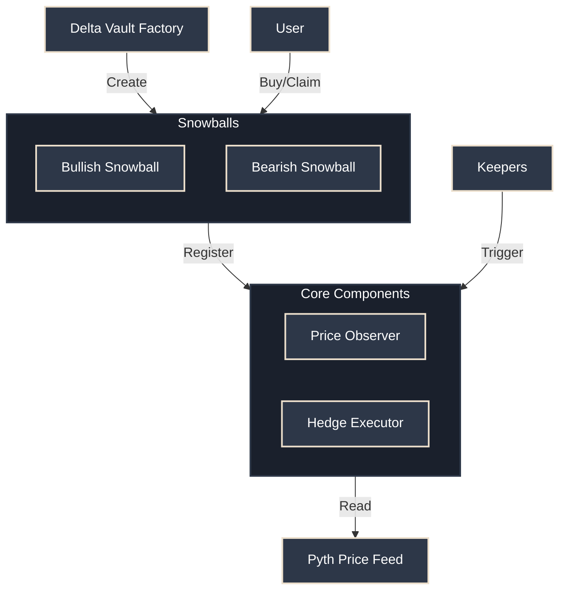

```mermaid
flowchart TB
    Factory["Delta Vault Factory"]
    subgraph Snowballs
        direction TB
        BullishV["Bullish Snowball"]
        BearishV["Bearish Snowball"]
    end
    
    subgraph Core["Core Components"]
        direction LR
        Observer["Price Observer"]
        Executor["Hedge Executor"]
    end
    
    User["User"]
    Pyth["Pyth Price Feed"]
    Keepers["Keepers"]

    %% Factory and User interactions
    Factory -->|Create| Snowballs
    User -->|Buy/Claim| Snowballs

    %% Registration flows
    Snowballs -->|Register| Core

    %% Price feed interactions
    Core -->|Read| Pyth

    %% Keeper triggers
    Keepers -->|Trigger| Core

    classDef default fill:#2D3748,stroke:#ECDFCC,stroke-width:2px,color:#ffffff
    classDef vaultGroup fill:#1A202C,stroke:#2D3748,stroke-width:2px,color:#ffffff
    class Snowballs,Core vaultGroup
```