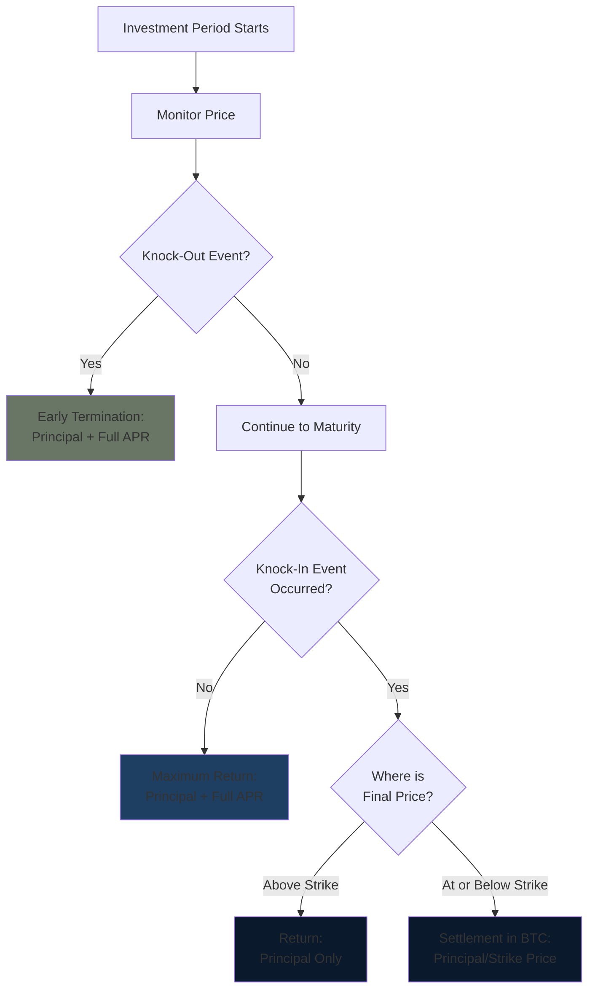

```mermaid
flowchart TB
    Start[Investment Period Starts] --> Monitor[Monitor Price]
    Monitor --> KO{Knock-Out Event?}
    
    KO -->|Yes| Early[Early Termination:
    Principal + Full APR]
    
    KO -->|No| Continue[Continue to Maturity]
    Continue --> KI{Knock-In Event
    Occurred?}
    
    KI -->|No| MaxReturn[Maximum Return:
    Principal + Full APR]
    
    KI -->|Yes| FinalPrice{Where is 
    Final Price?}
    
    FinalPrice -->|Above Strike| Principal[Return:
    Principal Only]

    FinalPrice -->|At or Below Strike| BTCSettle[Settlement in BTC:
    Principal/Strike Price]
    style Early fill:#697565
    style MaxReturn fill:#1E3E62
    style Principal fill:#0B192C
    style BTCSettle fill:#0B192C
```